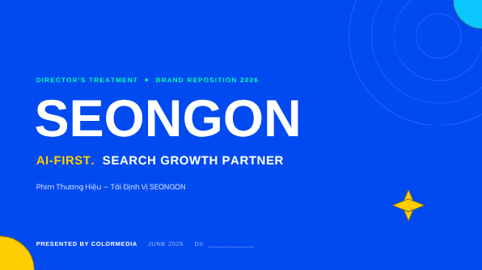

# Case studies — treatment làm bằng skill thật

Các hồ sơ treatment thật do ColorMedia dựng bằng skill `treatment` (Director Treatment).
Dùng để người dùng thấy đầu ra thực tế, không chỉ mô tả.

---

## 1. SEONGON — Tái định vị thương hiệu (Brand Reposition 2026)

| | |
|---|---|
| **Dự án** | SEONGON — *AI-First Search Growth Partner* |
| **Loại** | Phim Thương hiệu / Tái định vị (Brand Film · Brand Reposition) |
| **Tài liệu** | Director's Treatment 2026 — **45 slide** (bản thuyết trình) |
| **Dựng bằng** | Skill `treatment` (Treatment Architecture v1.3) + xuất Canva |
| **Đơn vị** | ColorMedia — 6/2026 |
| **Xem bản đầy đủ** | 🔗 https://canva.link/5om0ujrudjyw5w0 |

**Vì sao là case study tốt:** một treatment hoàn chỉnh 45 trang — cover định vị, mood &
tone, color palette phim, storyboard, đóng gói gửi khách — minh hoạ trọn quy trình
*generate-first* của skill từ kịch bản/brief đã chốt đến hồ sơ hình ảnh.

> 💡 Trang Đạo diễn trên cover còn để trống ("Dir. \_\_\_") — đúng cơ chế: skill kéo
> thông tin đạo diễn từ hồ sơ năng lực; điền hồ sơ một lần thì các treatment sau tự có.

---

> Có thêm case study? Thêm thumbnail vào `docs/case-studies/` và một mục theo mẫu trên.
